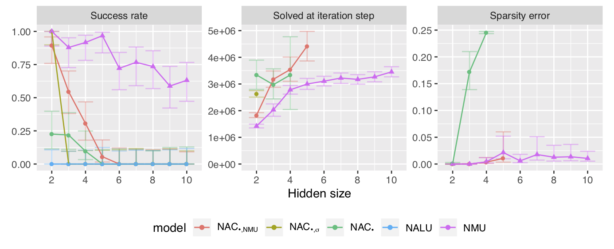

# Neural Arithmetic Units

This code encompass two publiations. The ICLR paper is still in review, please respect the double-blind review process.



_Figure, shows performance of our proposed NMU model._

## Publications

#### SEDL Workshop at NeurIPS 2019

A workshop paper published at SEDL|NeurIPS 2019 that is a reproduction study of NALU, proposes a better  evaluation criterion, includes a "converved at" metrics, and a "sparsity error" metrics.

```bib
@inproceedings{maep-madsen-johansen-2019,
    author={Andreas Madsen and Alexander Rosenberg Johansen},
    title={Measuring Arithmetic Extrapolation Performance},
    booktitle={Science meets Engineering of Deep Learning at 33rd Conference on Neural Information Processing Systems (NeurIPS 2019)},
    address={Vancouver, Canada},
    journal={CoRR},
    volume={abs/1910.01888},
    month={October},
    year={2019},
    url={http://arxiv.org/abs/1910.01888},
    archivePrefix={arXiv},
    primaryClass={cs.LG},
    eprint={1910.01888},
    timestamp={Fri, 4 Oct 2019 12:00:36 UTC}
}
```

#### ICLR 2020 (In-review)

The main paper, that analyses the challenges in NALU and propose several improvements. **This is under double-blind peer-review, please respect our anonymity and reference https://openreview.net/forum?id=H1gNOeHKPS and not this repository!**

```bib
@inproceedings{mnu-madsen-johansen-2020,
    author={Andreas Madsen and Alexander Rosenberg Johansen},
    title={Neural Arithmetic Units},
    booktitle={Submitted to International Conference on Learning Representations},
    year={2020},
    url={https://openreview.net/forum?id=H1gNOeHKPS},
    note={under review}
}
```

## Install

```bash
python3 setup.py develop
```

This will install this code under the name `stable-nalu`, and the following dependencies if missing: `numpy, tqdm, torch, scipy, pandas, tensorflow, torchvision, tensorboard, tensorboardX`.

## Experiments used in the paper

All experiments results shown in the paper can be exactly reproduced using fixed seeds. The `lfs_batch_jobs`
directory contains bash scripts for submitting jobs to an LFS queue. The `bsub` and its arguments, can be
replaced with `python3` or an equivalent command for another queue system.

The `export` directory contains python scripts for converting the tensorboard results into CSV files and
contains R scripts for presenting those results, as presented in the paper.

## Naming changes

As said earlier the naming convensions in the code are different from the paper. The following translations
can be used:

* Linear: `--layer-type linear`
* ReLU: `--layer-type ReLU`
* ReLU6: `--layer-type ReLU6`
* NAC-add: `--layer-type NAC`
* NAC-mul: `--layer-type NAC --nac-mul normal`
* NAC-sigma: `--layer-type PosNAC --nac-mul normal`
* NAC-nmu: `--layer-type ReRegualizedLinearPosNAC --nac-mul normal --first-layer ReRegualizedLinearNAC`
* NALU: `--layer-type NALU`
* NAU: `--layer-type ReRegualizedLinearNAC`
* NMU: `--layer-type ReRegualizedLinearNAC --nac-mul mnac`

## Extra experiments

Here are 4 experiments in total, they correspond to the experiments in the NALU paper.

```
python3 experiments/simple_function_static.py --help # 4.1 (static)
python3 experiments/sequential_mnist.py --help # 4.2
```

Example with using NMU on the multiplication problem:

```bash
python3 experiments/simple_function_static.py \
    --operation mul --layer-type ReRegualizedLinearNAC --nac-mul mnac \
    --seed 0 --max-iterations 5000000 --verbose \
    --name-prefix test --remove-existing-data
```

The `--verbose` logs network internal measures to the tensorboard. You can access the tensorboard with:

```
tensorboard --logdir tensorboard
```
